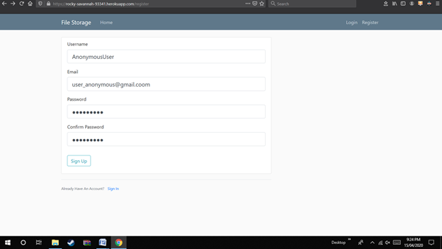
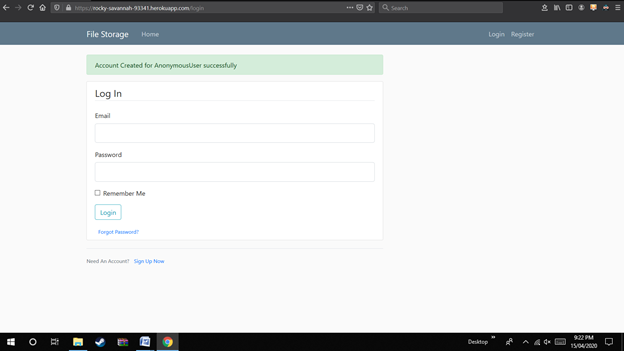
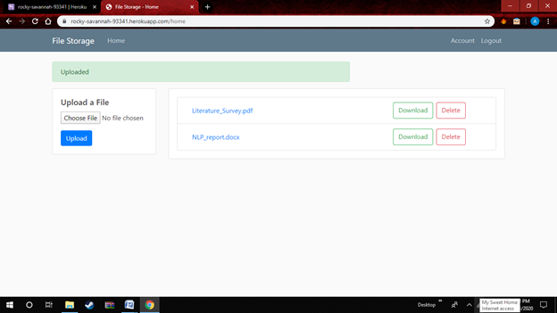
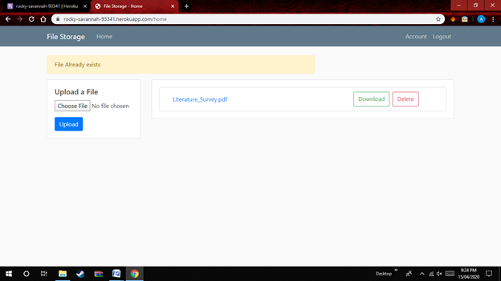

# File-Storage
 
File Storage System is website that allows user to store their data online on cloud and can access it from anywhere. The main feature of file storage is it does not allow file duplication with the help of MD5 algorithm. If any duplicate file is detected it notifies the user about the duplicate file thereby saving storage space.

1. Signup Screen:

2. Login Screen:

3. Upload Page (Uploaded):

4. Upload Page (File already exists):

* Create a python virtual environment, and install the requirements using 'pip install -r requirements.txt'
* To query and view the data stored, Open a terminal in the File-Storage folder
  * from Filestorage import db
  * from Filestorage.models import User, File 
* Create a folder named 'uploads' in the File-Storage directory
* Run the run.py script
* Copy the link in the output in your browser

#### And you're good to go